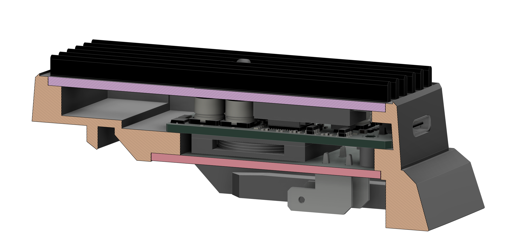

## Overview

Lidl sells batteries for their Parkside-branded power tools. These are 5S lithium-ion batteries that are well-constructed and cost approximately €20 for the 4 Ah version. While the cells are not from premium brands, they appear to be of relatively high quality. For instance, the 4 Ah battery I purchased contains Sunpower INR19/66 cells. Detailed information about these cells can be found here:  
[Parkside INR18650E 2000mAh (Blue) Review](https://lygte-info.dk/review/batteries2012/Parkside%20INR18650E%202000mAh%20(Blue)%20UK.html)  
[Sunpower High-Rate Lithium-Ion Battery Specifications](https://www.sunpowernewenergy.com/product/18650-high-rate-lithium-ion-battery-20p/)

Currently, Lidl offers a USB charger add-on for these batteries, but it has significant limitations. Its output power is restricted to 15 W, and it does not support charging the battery via USB.  
[Product page](https://www.lidl.de/p/parkside-20-v-akku-ladeadapter-pwca-20-li-a1/p100363956)

The adaptor described here comprises a 3D-printed enclosure and a PCB with soldered contacts that connect to the battery terminals. The interface PCB includes two mounting locations for power modules.

The screenshot shows a cross section view of the assembly.

The bi-directional 100 W USB-C module, based on the IP2368 chip, is used in the current implementation.

Future developments are planned, including a 240 W power module and a PCB with a microcontroller and control logic.

## IP2368

The IP2368 chip is available in several firmware versions. I chose the IP2368_I2C_NACT variant, which supports I2C communication and can function as a USB-C source immediately upon connection to a battery, without requiring an initial connection to a charger. Sourcing this chip outside China is challenging; I obtained mine via [LCSC](https://www.lcsc.com/product-detail/Power-Management-Specialized_INJOINIC-IP2368_I2C_COUT_C5372184.html). Note that a quotation request is necessary, as this chip is typically not in stock.

## Tasks

- [ ] Create and expand documentation (better photos)
- [ ] Replace the overview photo  
- [ ] Design a PCB for the microcontroller  
- [ ] Test the 100 W power module  
